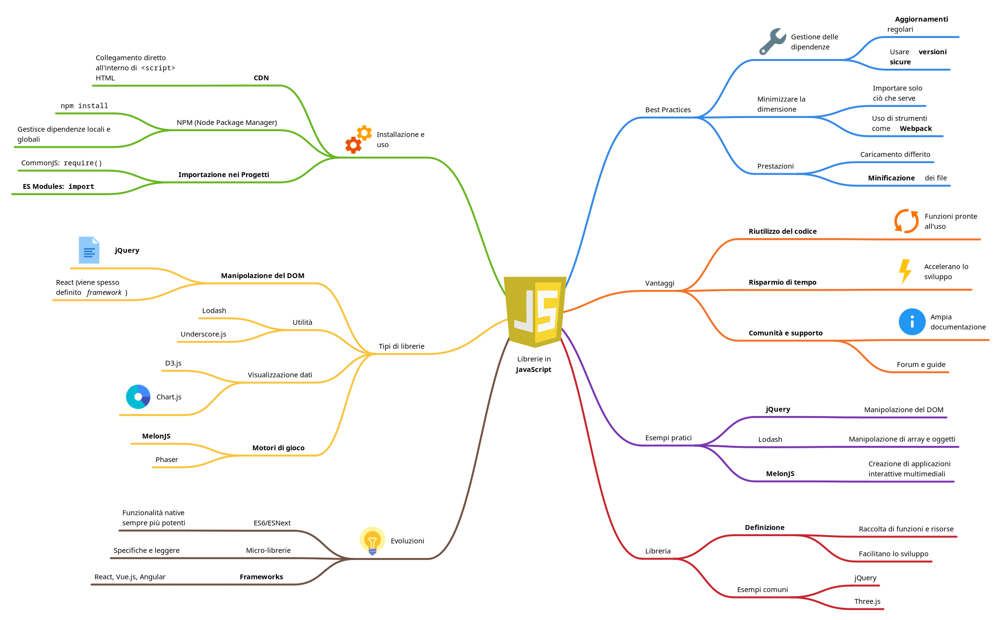
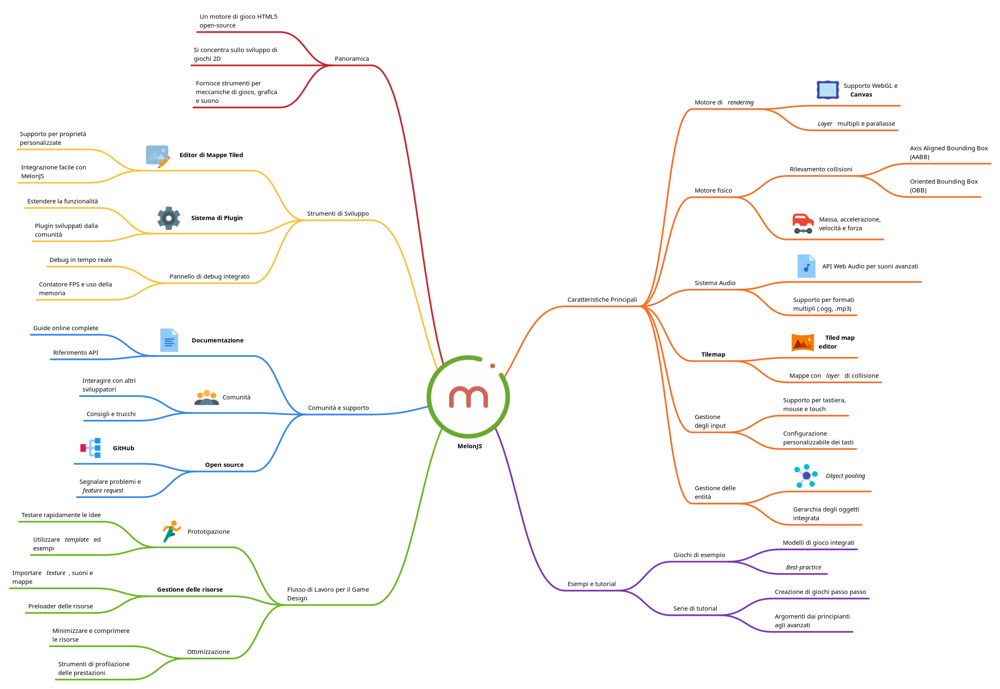

# Il mio browser game

Un [modello di gioco funzionante](https://ardesista.github.io/my-browser-game/) in stile RPG, sviluppato con la libreria JavaScript [MelonJS](https://melonjs.org/). È possibile personalizzarlo aggiungendo nuovi personaggi, un sistema di dialoghi, una storia, nuovi scenari, combattimento in tempo reale o a turni, elementi *puzzle* o qualsiasi cosa la fantasia ti suggerisca!

## Librerie in JavaScript

Le librerie in JavaScript sono collezioni di funzioni e moduli predefiniti che semplificano lo sviluppo applicativo, permettendo agli sviluppatori di risparmiare tempo ed energia. Offrono astrazioni per gestire attività comuni, come manipolazione del DOM, animazioni e integrazione di componenti interattivi. Utilizzare librerie consente agli sviluppatori di concentrarsi sulla logica dell'applicazione e sull'esperienza utente, piuttosto che risolvere problemi di base, promuovendo così una più rapida prototipazione e integrazione di funzionalità. 

## MelonJS

MelonJS offre una suite completa di strumenti per lo sviluppo di giochi 2D, permettendo agli sviluppatori di creare esperienze di gioco ricche in modo efficiente. Adattp a principianti e a sviluppatori esperti, MelonJS fornisce numerose risorse per supportare il percorso di sviluppo di applicazioni web altamente interattive e multimediali.

## Risorse

- [Tiled map editor](https://www.mapeditor.org/)
- [Documentazione di MelonJS](https://melonjs.github.io/melonJS/)
- [MelonJS: platformer tutorial](https://melonjs.github.io/tutorial-platformer/)
- [MelonJS: applicazioni d'esempio](https://github.com/melonjs/examples/)
- [MelonJS: codice sorgente](https://github.com/melonjs/melonJS)
- [Licenza MIT](https://it.wikipedia.org/wiki/Licenza_MIT)
